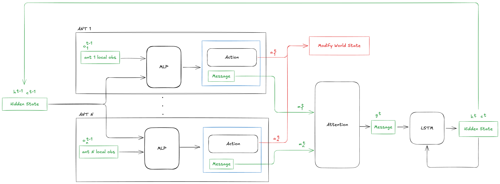

# SWARM

## A Note on Shouting Ants

During a late-night brainstorming session with Ty and Diego, Ty remarked:

> "Ants will have to learn to be louder."

It got me thinking — in systems where many agents share space and limited bandwidth, communication isn't just about speaking. It's about _being heard_, _when_, _by whom_, and _how much_.

This naturally led us toward attention — a way for agents to learn not just to broadcast messages, but to determine whose voice to listen to and when. It’s a framework not just for noise, but for meaningful signal in a dynamic, decentralized team.

---

## Purpose & Overview

This project is part of a Stanford reinforcement learning course. We are developing a multi-agent simulation environment where ants work together to move an object to a goal position in a 2D top-down world. The project explores:

- **Collaboration** between identical agents through shared models and memory.
- **Communication** via learned message vectors, broadcast and consumed at each step.
- **Adaptability** through variable environment configurations and agent counts.
- **Attention and memory**, both as emergent properties and architectural features.

We aim to understand and prototype shared intelligence, especially under the constraints of decentralized observation and real-time decision-making.

---

## Environment

### Setup

- A variable number of ants in a bounded 2D top-down space.
- A movable object placed somewhere in the environment.
- A goal location defined.
- Ants must coordinate to move the object to the goal.

### Characteristics

- **Agents (Ants)**: Homogeneous, fully shared policy and memory.
- **Object**: Varying mass, shape, and friction across episodes.
- **Goal**: Fixed or moving.
- **Physics**: Simplified continuous dynamics.
- **Simulation Backend**: Built with [Madrona Engine](https://madrona-engine.github.io/).

---

## Ant Observation Space

Each ant receives:

- **Local State (4 dims)**
  - Position (x, y)
  - Velocity (vel_x, vel_y)

- **Task-Relevant Vectors (4 dims)**
  - Relative position to object
  - Relative position to goal

- **Raycast Perception (Configurable)**
  - Example: 6 rays x 3 features = 18 dims
  - Each ray: distance + entity class (Wall/Object/Ant/None)

- **Cloud Communication Input (16 dims)**
  - Aggregated vector from previous timestep messages.

Example total (with 6 raycasts): 42 dims.

---

## Ant Output Space

Each ant outputs:

- **Action (2 dims)**: Target velocity (x, y)
- **Message (16 dims)**: Communication vector for cloud input at the next step.

---

## Architecture

### System Flow per Timestep

1. Each ant emits a message $m^{t-1}$.
2. All messages are gathered and processed via self-attention into a global vector $g^{t-1}$.
3. Global LSTM consumes $g^{t-1}$ to update hidden state $(h^t, c^t)$.
4. Memory $h^t$ is broadcast to each ant.
5. Ants produce actions $a^t$ and messages $m^t$ from local observation $o^t$ and memory $h^t$.

- **Attention** selects key information from messages.
- **Shared LSTM** acts as a swarm "brain."
- **Shared MLP** converts observations + memory into actions and messages.
- Dynamic number of agents supported (spawn/despawn without retraining).



---

## Attention Mechanism

Allows each ant to:

- Focus on relevant messages.
- Broadcast high-priority signals.

Implemented as:
```python
query_i = W_q(m_i)
keys    = W_k(messages)
values  = W_v(messages)

scores  = query_i @ keys.T / sqrt(d_k)
weights = softmax(scores)
cloud_input_i = weights @ values
```

---

## Reward Function

Let $d_t = \| \text{object}_t - \text{goal} \|_2$ be object-goal distance.

- **Step reward**:  $r_t^{\mathrm{step}} = 0.1\,(d_{t-1} - d_t)$
- **Goal reward**:  $r_t^{\mathrm{goal}} = +1$ if $d_t \le \epsilon$
- **Existential penalty**:  $r_t^{\mathrm{exist}} = -\frac{1}{T_{max}}$ per timestep

---

## Training Strategy

- **Framework**: PyTorch
- **Algorithm**: PPO with full parameter sharing
- **Parallelization**: Madrona for thousands of environments

Evaluation Metrics:
- Task success
- Coordination quality (force alignment, message entropy)
- Robustness to agent dropout or noise
- Emergent role formation
